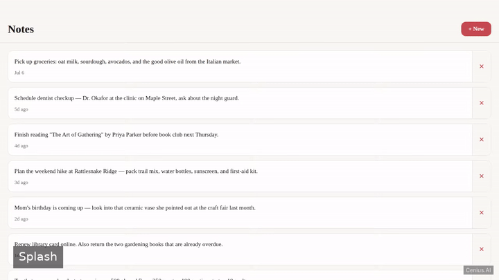
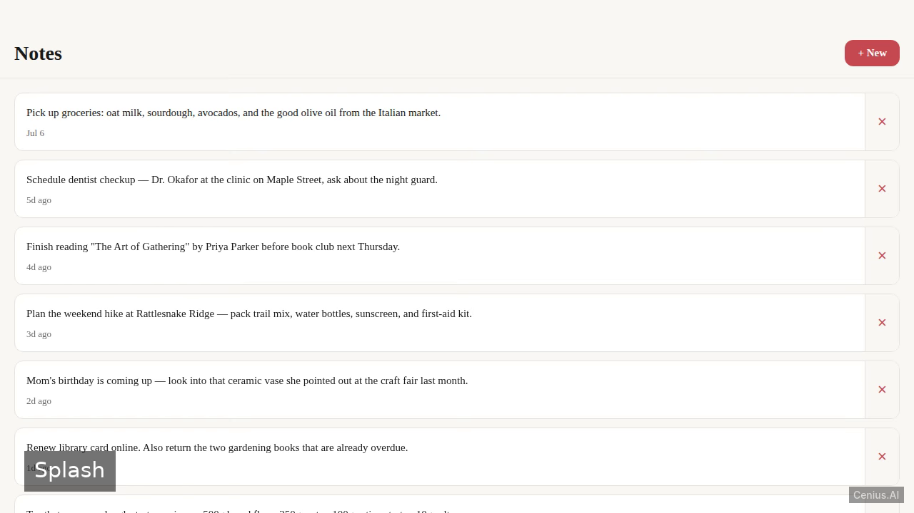
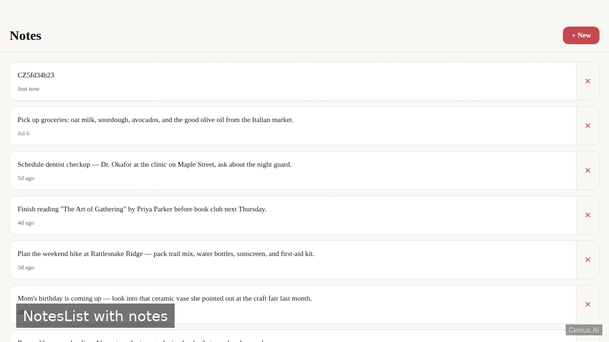

# NotesApp — Node.js to-do list app reference implementation

This repository contains the complete source for **NotesApp**, an open-source to-do list app built with Node.js. A simple notes application built with React Native and Expo for the web, allowing users to create, view, and delete notes stored locally via AsyncStorage. Everything NotesApp needs to run is here — code, seed data, install scripts. Apache-2.0-licensed — use NotesApp commercially, self-host it, or [remix NotesApp on cenius.ai](https://cenius.ai/marketplace/p/notesapp?ref=gh&utm_campaign=notesapp-nodejs) to make it yours.


[](LICENSE)  [](https://cenius.ai)

[](https://cenius.ai/marketplace/p/notesapp?ref=gh&utm_campaign=notesapp-nodejs)

> **▶ [Open & edit in cenius.ai](https://cenius.ai/marketplace/p/notesapp?ref=gh&utm_campaign=notesapp-nodejs)** — one click to an editable workspace: describe changes in plain English, get an instant preview, one-click deploy and host. Modifications made on the platform come with full rebrand & relicense rights.

_Local clone? See [Quick start](#quick-start) below. cenius.ai is the zero-setup path._

## Demo



▶ **[Full demo walkthrough](https://cenius.ai/marketplace/p/notesapp?ref=gh&utm_campaign=notesapp-nodejs)** — watch it on the project page · [download MP4](.github/media/demo.mp4)

## Screenshots

  

## Architecture

Node.js project, delivered as a complete runnable codebase (22 files). Top-level layout: `assets/`, `src/`. One command (`./install.sh`) covers dependency setup and demo-data seeding. Full setup details: [`INSTALL.md`](INSTALL.md).

## Features

- View Notes List
- Add New Note
- Delete Note

## Quick start

```bash
./install.sh   # installs dependencies + seeds demo data
```

See [`INSTALL.md`](INSTALL.md) for full setup and usage instructions.

## Usage guide

Once the development server is running (via `npm run dev`), open the provided URL (default `http://localhost:8081`) in your browser.

### Screens

#### Notes List
- The main screen displays all saved notes.
- Each note shows its title and a preview of its content.
- Navigate to the Add Note screen to create a new note.
- Tap a note’s delete icon to remove it permanently.

#### Add Note
- A form where you enter a note title and content.
- Tap **Save** to store the note and return to the list.
- Empty titles or content are not accepted.

### Data Persistence

All notes are saved locally in your browser using AsyncStorage. Clearing browser storage will erase all notes.

_Full guide: [`USAGE.md`](USAGE.md)_

## FAQ

### What does it take to self-host NotesApp?

Everything you need ships in this repo: clone it, run `./install.sh` to install dependencies and seed demo data, then follow [`INSTALL.md`](INSTALL.md) to start it. No external services required.

### How can I customize NotesApp without editing code?

Describe what you want changed on [cenius.ai](https://cenius.ai/marketplace/p/notesapp?ref=gh&utm_campaign=notesapp-nodejs) — no code editing needed; the platform produces a fresh build you can download and deploy.

### Can I remove the NotesApp name and use my own?

Rebranding is straightforward under the MIT license — change what you want in the source. Or [open it on cenius.ai](https://cenius.ai/marketplace/p/notesapp?ref=gh&utm_campaign=notesapp-nodejs): the platform handles the changes and grants full rebrand rights on the result.

### Which technology stack does NotesApp use?

NotesApp runs on Node.js. This repo holds the full production source: you can inspect every part of it before deploying. Highlights include view Notes List.

### Is it OK to ship NotesApp as part of a product?

The code is under the Apache-2.0 license, which allows commercial use without restriction. You can build, sell, and deploy it freely. Full text: [LICENSE](LICENSE).

## License & rebranding

Released under the [Apache License 2.0](LICENSE) (© 2026 Cenius AI) — free for personal and commercial use. The Cenius name/logo are trademarks (see NOTICE).

**Need a customized version?** [Remix this app on cenius.ai](https://cenius.ai/marketplace/p/notesapp?ref=gh&utm_campaign=notesapp-nodejs) — modifications made on the platform come with **full rebrand & relicense rights** over your derivative.

## Built with cenius.ai

This entire application — code, design, seeded demo data — was generated on **[cenius.ai](https://cenius.ai)** from a plain-English description.

- 🚀 [Build your own app on cenius.ai](https://cenius.ai)
- 🎛️ [Remix NotesApp on the marketplace](https://cenius.ai/marketplace/p/notesapp?ref=gh&utm_campaign=notesapp-nodejs) — open it in a workspace, prompt for changes, and ship your own version.

More open-source apps: [the Cenius-ai catalog](https://github.com/Cenius-ai) · [showcase index](https://github.com/Cenius-ai/showcase)
